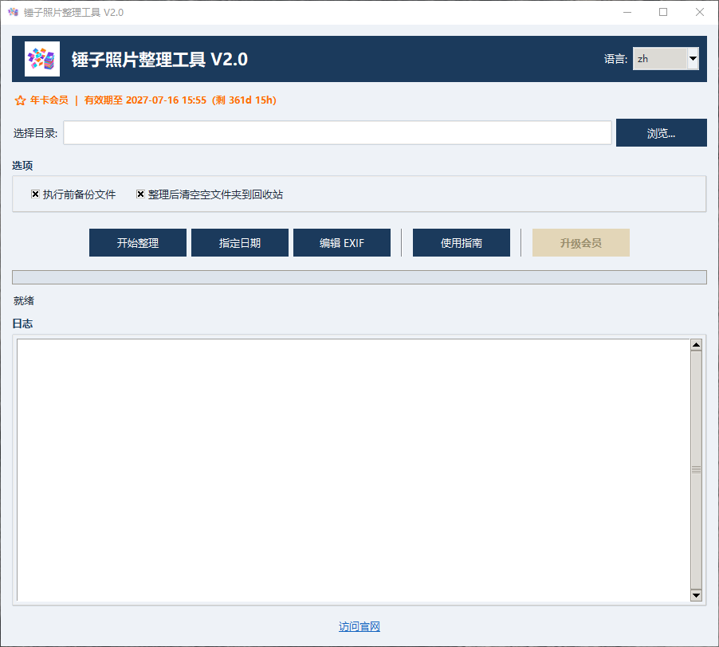
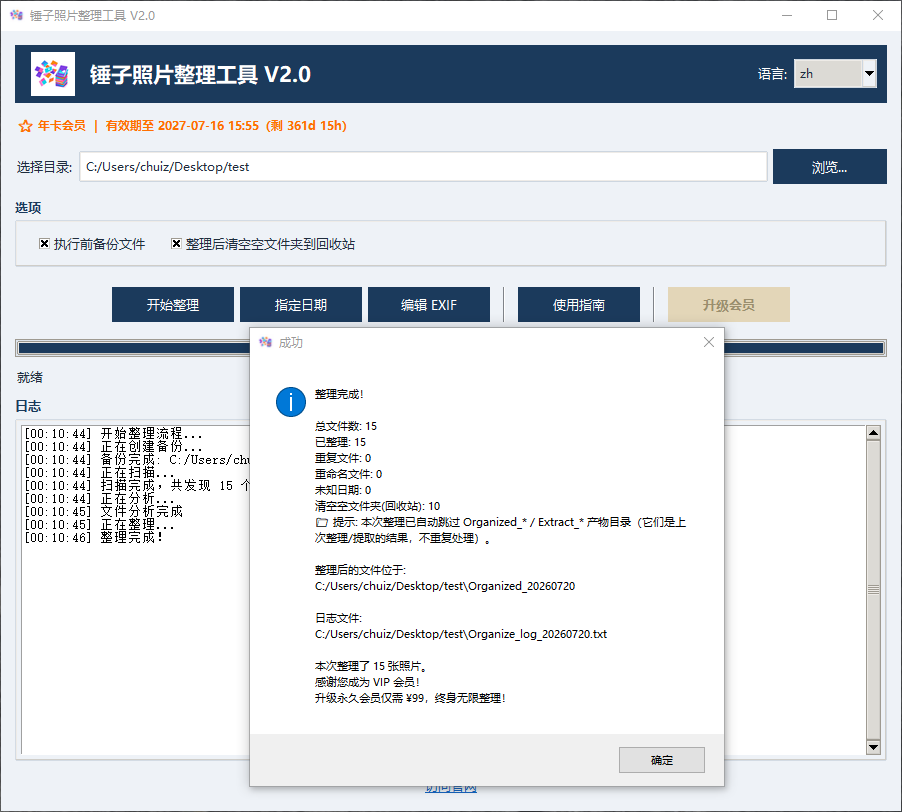
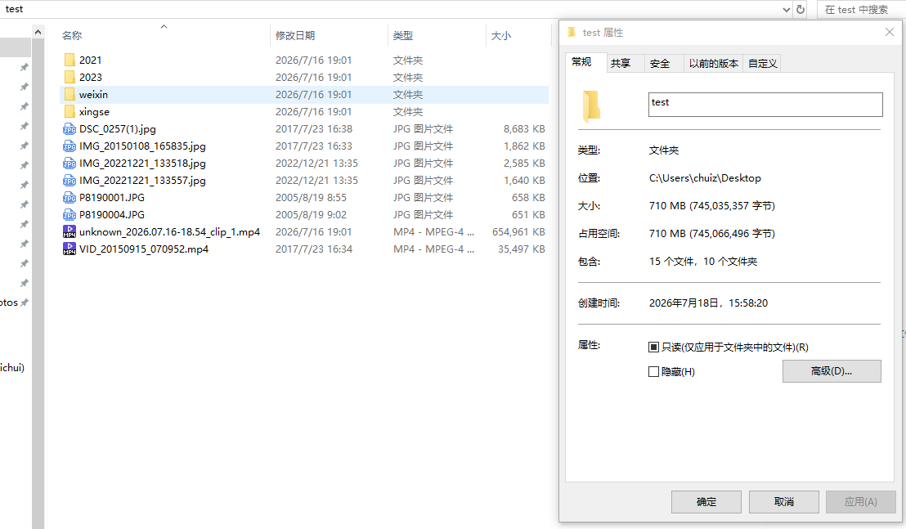
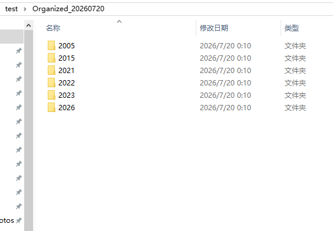

# 锤子照片整理工具 (Hammer Photo Organizer) V2.0

> 一款**本地运行**的照片 / 视频整理工具：按拍摄日期把一团乱的照片视频，自动归档到「年 / 月」文件夹。支持智能去重、按日期提取、会员无限量整理。
>
> ⚠️ **版权声明**：本软件为闭源商业软件，保留所有权利。本仓库仅用于发布**编译后的可执行文件下载入口与说明文档**，**不提供源代码**，未经许可不得反向工程、复制、分发或修改。

## 📥 下载

| 版本 | 说明 | 下载 |
|---|---|---|
| 压缩包（绿色版 + 安装版） | 解压即用 / 双击安装 | https://chuisoft.cn/assets/files/HammerPhoto_v2.0_Windows.zip |
| 绿色版 exe | 解压双击即用，免安装 | 见上方压缩包 |
| 安装版 Setup | 双击按向导安装 | 见上方压缩包 |

> 更多版本与说明见官网：https://chuisoft.cn

## ✨ 功能特性

- **一键整理**：选文件夹 → 点「开始整理」→ 自动按「年 / 月」归档
- **智能日期识别**：EXIF → 文件名 → 文件时间，逐级回退
- **自动去重**：按 MD5 比对，保留原片
- **整理后自动清场**：空掉的子文件夹自动移入回收站（可恢复）
- **按日期提取**：指定时间段导出，原文件一个都不动
- **会员无限量**：免费版前 5 次不限量、之后每次 100 张；会员扫码支付开通年卡 / 永久

## 💻 系统要求

- Windows 7 / 10 / 11（64 位）
- 无需联网即可整理（仅会员支付时需要联网）

## 🔒 隐私政策

软件纯本机运行，照片视频**不上传任何服务器**。完整隐私说明见：https://chuisoft.cn/privacy/hammer-photo.html

## 📸 截图

### 软件主界面

### 整理完成弹窗

### 整理前（一团乱）

### 整理后（按年/月归档）

---

完整发布说明见 [Release_Notes.md](Release_Notes.md)；使用指南见 [功能说明与使用指南.md](功能说明与使用指南.md)。
